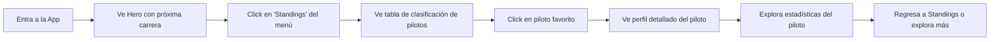
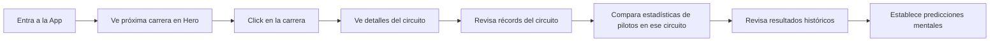

# Aplicación Web Formula 1 - Especificaciones de Diseño

**Versión**: 1.0
**Última actualización**: 2026-01-02
**Diseñador**: Senior UX/UI Designer
**Estado**: Fase de Diseño - Sprint 1

---

## 📐 Índice

1. [Recorridos de Usuario y Flujos](#recorridos-de-usuario-y-flujos)
2. [Arquitectura de Información](#arquitectura-de-información)
3. [Sistema de Diseño](#sistema-de-diseño)
4. [Wireframes de Alta Fidelidad](#wireframes-de-alta-fidelidad)
5. [Componentes Reutilizables](#componentes-reutilizables)
6. [Navegación e Interacciones](#navegación-e-interacciones)
7. [Diseño Responsivo](#diseño-responsivo)
8. [Accesibilidad WCAG 2.1](#accesibilidad-wcag-21)
9. [Animaciones y Micro-interacciones](#animaciones-y-micro-interacciones)
10. [Consideraciones de Rendimiento](#consideraciones-de-rendimiento)

---

## 1. Recorridos de Usuario y Flujos

### Recorrido Principal 1: Fanático Casual - Revisar Clasificaciones

**Persona**: Juan, 28 años, fanático casual que quiere saber quién va ganando el campeonato.



**Fricción potencial identificada**:
- ⚠️ Si la tabla de clasificaciones es muy larga, el usuario móvil debe hacer mucho scroll. **Solución**: Header pegajoso con posiciones top 3 siempre visibles.
- ⚠️ Si no hay claridad visual entre pilotos del mismo equipo. **Solución**: Usar los colores oficiales del equipo como borde izquierdo de cada fila.

### Recorrido Principal 2: Fanático Hardcore - Análisis Pre-Carrera

**Persona**: María, 35 años, fanática experta que quiere analizar datos antes del próximo GP.



**Fricción potencial identificada**:
- ⚠️ Sobrecarga de información en una sola pantalla. **Solución**: Sistema de pestañas para separar "Info del Circuito", "Récords", "Resultados Históricos".
- ⚠️ Gráficos complejos pueden ser confusos. **Solución**: Tooltips interactivos con explicaciones.

### Recorrido Principal 3: Nuevo Usuario - Descubrimiento

**Persona**: Carlos, 22 años, nuevo fanático que quiere aprender sobre F1.

```mermaid
graph LR
    A[Primera visita] --> B[Ve Home con contexto]
    B --> C[Explora sección 'Drivers']
    C --> D[Ve grid de pilotos con fotos]
    D --> E[Click en piloto que le llama la atención]
    E --> F[Lee biografía y estadísticas]
    F --> G[Descubre escudería del piloto]
    G --> H[Explora otros pilotos del equipo]
    H --> I[Se convierte en fanático del equipo]
```



**Fricción potencial identificada**:
- ⚠️ Jerga técnica sin explicación (DRS, fastest lap, etc.). **Solución**: Tooltips con definiciones simples en términos técnicos.
- ⚠️ No saber por dónde empezar. **Solución**: Onboarding sutil con highlights visuales en primera visita.

---

## 2. Arquitectura de Información

### Mapa del Sitio

```
Formula 1 App
│
├── Home (Dashboard)
│   ├── Hero: Próxima carrera + cuenta regresiva
│   ├── Clasificaciones Rápidas (Top 5 pilotos y constructores)
│   ├── Últimas noticias (Fase 2)
│   └── Highlights de la temporada
│
├── Standings (Clasificaciones)
│   ├── Campeonato de Pilotos
│   └── Campeonato de Constructores
│
├── Drivers (Pilotos)
│   ├── Grid de todos los pilotos
│   └── [Detalle de Piloto]
│       ├── Perfil y Bio
│       ├── Estadísticas de temporada
│       ├── Resultados por carrera
│       └── Datos históricos (Fase 2)
│
├── Teams (Escuderías/Constructores)
│   ├── Grid de escuderías
│   └── [Detalle de Equipo]
│       ├── Información del equipo
│       ├── Pilotos actuales
│       ├── Estadísticas de temporada
│       └── Historia del equipo (Fase 2)
│
├── Races (Carreras/Calendario)
│   ├── Lista de carreras de la temporada
│   └── [Detalle de Carrera]
│       ├── Información del circuito
│       ├── Horarios (FP1, FP2, FP3, Quali, Race)
│       ├── Resultados (si ya ocurrió)
│       └── Récords del circuito (Fase 2)
│
└── [Búsqueda] (Fase 2)
    ├── Búsqueda global
    └── Filtros avanzados
```

### Jerarquía de Navegación

**Nivel 1 (Navegación Principal)**:
- Home
- Standings
- Drivers
- Teams
- Races

**Nivel 2 (Secundaria/Contextual)**:
- Dentro de Standings: Pestañas (Drivers / Constructors)
- Dentro de Detalle de Carrera: Pestañas (Info / Results / Stats)

**Nivel 3 (Terciaria)**:
- Breadcrumbs en páginas de detalle
- Links relacionados en sidebars

---

## 3. Sistema de Diseño

### 3.1 Paleta de Colores

**Tema Oscuro (Predeterminado)** - Inspirado en el ambiente nocturno de las carreras urbanas y la tecnología de F1

#### Colores Primarios

```
Colores de Fondo:
- bg-dark-950:    #0A0A0B (Fondo principal - negro casi puro)
- bg-dark-900:    #131316 (Fondo de cards/secciones)
- bg-dark-800:    #1C1C21 (Fondo de elementos elevados)
- bg-dark-700:    #27272E (Estados hover)

Colores de Texto:
- text-light-50:  #FAFAFA (Texto principal - blanco casi puro)
- text-light-100: #E5E5E7 (Texto secundario)
- text-light-400: #9CA3AF (Texto terciario/hints)
- text-light-600: #6B7280 (Texto deshabilitado)

Colores de Acento (F1 Racing):
- accent-red-500:    #E10600 (Rojo F1 oficial - inspirado en Ferrari)
- accent-red-600:    #C00500 (Rojo más oscuro para hover)
- accent-neon-500:   #FF1E00 (Neón rojo para highlights)
- accent-cyan-500:   #00E0FF (Cyan tecnológico - inspirado en Mercedes)
- accent-gold-500:   #FFD700 (Dorado para podium/ganadores)

Colores de Equipo (Para uso en componentes):
- ferrari-red:       #DC0000
- mercedes-silver:   #00D2BE
- red-bull-blue:     #0600EF
- mclaren-orange:    #FF8700
- alpine-blue:       #0090FF
- aston-green:       #006F62
- williams-blue:     #005AFF
- alfa-red:          #900000
- haas-grey:         #787878
- alphatauri-navy:   #2B4562
```

#### Colores Semánticos

```
Success (Éxito):  #10B981 (Ganador, completado)
Warning (Advertencia):  #F59E0B (Atención, fastest lap)
Error:    #EF4444 (Error, DNF - Did Not Finish)
Info:     #3B82F6 (Información, tooltips)
```

**Tema Claro (Opcional - Fase 2)**

```
- bg-light-50:    #FFFFFF (Fondo principal)
- bg-light-100:   #F9FAFB (Fondo de cards)
- text-dark-900:  #111827 (Texto principal)
- (Mantener mismos colores de acento para consistencia)
```

### 3.2 Tipografía

**Fuentes Seleccionadas**:

```css
/* Encabezados - Moderna, tecnológica, inspirada en racing */
font-family-heading: 'Formula1 Display', 'Rajdhani', 'Inter', sans-serif;
- Características: Geométrica, condensada, alto impacto visual
- Uso: Títulos principales, números grandes, secciones hero

/* Body - Alta legibilidad para datos densos */
font-family-body: 'Inter', 'Roboto', system-ui, sans-serif;
- Características: Excelente legibilidad, variable font
- Uso: Texto de contenido, descripciones, párrafos

/* Monospace - Para datos técnicos */
font-family-mono: 'JetBrains Mono', 'Roboto Mono', monospace;
- Características: Monoespaciada, clara
- Uso: Tiempos de carrera, datos numéricos, códigos
```

**Escala Tipográfica** (Basada en Tailwind):

```
Título Hero:      text-6xl   (60px) / font-black   / line-height: 1.1
Título de Página: text-4xl   (36px) / font-bold    / line-height: 1.2
Título de Sección: text-2xl   (24px) / font-semibold / line-height: 1.3
Título de Card:   text-xl    (20px) / font-semibold / line-height: 1.4
Body Grande:      text-lg    (18px) / font-normal  / line-height: 1.6
Body:             text-base  (16px) / font-normal  / line-height: 1.5
Body Pequeño:     text-sm    (14px) / font-normal  / line-height: 1.5
Caption:          text-xs    (12px) / font-medium  / line-height: 1.4
```

**Pesos de Fuente**:
- Regular (400): Texto de contenido
- Medium (500): Énfasis sutil, labels
- Semibold (600): Subtítulos, headers de tabla
- Bold (700): Títulos importantes
- Black (900): Títulos hero, números destacados

### 3.3 Espaciado y Grid

**Sistema de Espaciado** (Basado en 8px):

```
xs:  4px   (0.5 rem)
sm:  8px   (1 rem)
md:  16px  (2 rem)
lg:  24px  (3 rem)
xl:  32px  (4 rem)
2xl: 48px  (6 rem)
3xl: 64px  (8 rem)
```

**Sistema de Grid**:
- Container máximo: 1440px (Desktop), 100% (Mobile/Tablet)
- Columnas: 12 columnas con gap de 24px (desktop), 16px (mobile)
- Márgenes laterales: 24px (mobile), 32px (tablet), 48px (desktop)

### 3.4 Bordes y Sombras

**Border Radius**:
```
none:     0px     (Para elementos que necesitan ser completamente cuadrados)
sm:       4px     (Pequeños elementos, badges)
md:       8px     (Cards, botones)
lg:       12px    (Componentes grandes)
xl:       16px    (Modales, overlays)
full:     9999px  (Botones circulares, avatars)
```

**Sombras** (Para dar profundidad en modo oscuro):
```css
shadow-sm:  0 1px 2px rgba(0, 0, 0, 0.3)
shadow-md:  0 4px 6px rgba(0, 0, 0, 0.4)
shadow-lg:  0 10px 15px rgba(0, 0, 0, 0.5)
shadow-xl:  0 20px 25px rgba(0, 0, 0, 0.6)

/* Sombra especial con brillo neón para elementos destacados */
shadow-neon: 0 0 20px rgba(255, 30, 0, 0.4), 0 0 40px rgba(255, 30, 0, 0.2)
```

### 3.5 Iconografía

**Sistema de Iconos**: Lucide React (consistente, moderno, open-source)

**Tamaños de Iconos**:
```
xs:  12px  (Iconos inline)
sm:  16px  (Botones pequeños, badges)
md:  20px  (Navegación, botones estándar)
lg:  24px  (Headers, acciones principales)
xl:  32px  (Estados vacíos, iconos decorativos)
2xl: 48px  (Secciones hero, grandes ilustraciones)
```

**Iconos Clave**:
- Trophy: Ganadores, podium
- Flag: Carreras, inicio/fin
- User: Pilotos
- Users: Equipos
- Calendar: Calendario de carreras
- BarChart: Estadísticas
- Clock: Tiempos de vuelta
- Star: Favoritos
- Search: Búsqueda
- ChevronRight/Left: Navegación
- X (Close): Cerrar modales
- Menu: Menú móvil

---

## 4. Wireframes de Alta Fidelidad

### 4.1 Home / Dashboard

**Objetivo UX**: Primera impresión impactante que muestre el estado actual de la temporada y enganche al usuario.

#### Layout Desktop (1440px)

```
┌─────────────────────────────────────────────────────────────────┐
│ HEADER (Sticky, bg-dark-900, altura: 72px)                      │
│ ┌──────────┐    ┌────────────────────────────┐    ┌──────────┐ │
│ │ F1 LOGO  │    │ Home  Standings  Drivers   │    │ Search   │ │
│ │ (40x40)  │    │       Teams     Races      │    │ [Theme]  │ │
│ └──────────┘    └────────────────────────────┘    └──────────┘ │
└─────────────────────────────────────────────────────────────────┘

┌─────────────────────────────────────────────────────────────────┐
│ SECCIÓN HERO (bg-gradient-dark, altura: 480px)                  │
│ ┌────────────────────────────────────────────────────────────┐  │
│ │ [Fondo: Imagen del circuito de la próxima carrera          │  │
│ │  con overlay oscuro 70%]                                   │  │
│ │                                                            │  │
│ │  PRÓXIMA CARRERA                                           │  │
│ │  ┌──────────────────────────────────────────────────────┐ │  │
│ │  │ GRAN PREMIO DE MÓNACO               [Icono Flag: 🇲🇨] │ │  │
│ │  │ text-6xl font-black text-light-50                    │ │  │
│ │  │                                                      │ │  │
│ │  │ Circuit de Monaco                                    │ │  │
│ │  │ text-xl text-light-100                               │ │  │
│ │  │                                                      │ │  │
│ │  │ ┌──────────────────────────────────────────────┐    │ │  │
│ │  │ │ CUENTA REGRESIVA (text-4xl font-bold accent-red) │ │  │
│ │  │ │ 15 DÍAS  :  08 HRS  :  23 MIN                │    │ │  │
│ │  │ └──────────────────────────────────────────────┘    │ │  │
│ │  │                                                      │ │  │
│ │  │ [Botón: Ver Detalles →] (accent-red-500, hover)     │ │  │
│ │  └──────────────────────────────────────────────────────┘ │  │
│ └────────────────────────────────────────────────────────────┘  │
└─────────────────────────────────────────────────────────────────┘

┌─────────────────────────────────────────────────────────────────┐
│ CONTAINER (max-w-1440px, padding: 48px)                         │
│                                                                  │
│ ┌──────────────────────────────────────────────────────────┐    │
│ │ SECCIÓN: CLASIFICACIONES DEL CAMPEONATO                  │    │
│ │ text-2xl font-semibold text-light-50 + [Ver Todo →]     │    │
│ └──────────────────────────────────────────────────────────┘    │
│                                                                  │
│ ┌─────────────────────────────┐  ┌──────────────────────────┐  │
│ │ CAMPEONATO DE PILOTOS       │  │ CAMPEONATO DE CONSTRUCTORES│ │
│ │ (Card bg-dark-900, p-6)     │  │ (Card bg-dark-900, p-6)  │  │
│ │                             │  │                          │  │
│ │ 1. [🏆] Max Verstappen      │  │ 1. [🏆] Red Bull Racing  │  │
│ │    [Barra Color Equipo: Azul]│ │    [Logo Equipo 40x40]   │  │
│ │    Red Bull  |  287 pts     │  │    425 pts               │  │
│ │    (Fila: efecto hover)     │  │    (Fila: efecto hover)  │  │
│ │                             │  │                          │  │
│ │ 2. Sergio Pérez             │  │ 2. Mercedes              │  │
│ │    [Barra Color Equipo: Azul]│ │    [Logo Equipo]         │  │
│ │    Red Bull  |  223 pts     │  │    358 pts               │  │
│ │                             │  │                          │  │
│ │ 3. Lewis Hamilton           │  │ 3. Ferrari               │  │
│ │    [Barra Color Equipo: Cyan]│ │    [Logo Equipo]         │  │
│ │    Mercedes  |  198 pts     │  │    312 pts               │  │
│ │                             │  │                          │  │
│ │ 4. Charles Leclerc          │  │ 4. McLaren               │  │
│ │    [Barra Color Equipo: Rojo]│ │    [Logo Equipo]         │  │
│ │    Ferrari   |  175 pts     │  │    285 pts               │  │
│ │                             │  │                          │  │
│ │ 5. Fernando Alonso          │  │ 5. Alpine                │  │
│ │    [Barra Color Equipo: Verde]│ │   [Logo Equipo]         │  │
│ │    Aston Martin | 154 pts   │  │    198 pts               │  │
│ │                             │  │                          │  │
│ │ [Ver clasificación completa]│  │ [Ver clasificación]      │  │
│ └─────────────────────────────┘  └──────────────────────────┘  │
│                                                                  │
│ ┌──────────────────────────────────────────────────────────┐    │
│ │ SECCIÓN: CALENDARIO DE CARRERAS                          │    │
│ │ text-2xl font-semibold + [Ver Calendario Completo →]    │    │
│ └──────────────────────────────────────────────────────────┘    │
│                                                                  │
│ ┌────────────────────────────────────────────────────────────┐  │
│ │ [Container Scroll Horizontal - Cards de próximas carreras] │  │
│ │                                                            │  │
│ │ ┌──────┐  ┌──────┐  ┌──────┐  ┌──────┐  ┌──────┐        │  │
│ │ │Carrera8│ │Carrera9│ │Carrera10│ │Carrera11│ │Carrera12││
│ │ │      │  │PRÓXIMA│ │      │  │      │  │      │        │  │
│ │ │Mónaco│  │Canadá│  │España│  │Austria│ │Reino │        │  │
│ │ │      │  │      │  │      │  │      │  │Unido │        │  │
│ │ │PASADA│  │Jun 18│  │Jun 25│  │Jul 2 │  │Jul 9 │        │  │
│ │ │[✓]   │  │[●]   │  │      │  │      │  │      │        │  │
│ │ └──────┘  └──────┘  └──────┘  └──────┘  └──────┘        │  │
│ └────────────────────────────────────────────────────────────┘  │
│                                                                  │
└─────────────────────────────────────────────────────────────────┘

┌─────────────────────────────────────────────────────────────────┐
│ FOOTER (bg-dark-900, padding: 48px 0)                           │
│ ┌────────────────────────────────────────────────────────────┐  │
│ │ Logo F1 App                                                │  │
│ │                                                            │  │
│ │ Enlaces Rápidos:  Acerca de  |  API  |  Privacidad  |  Términos│
│ │                                                            │  │
│ │ © 2026 Formula 1 Fan App. No afiliado con FIA/FOM.        │  │
│ │ text-sm text-light-400                                     │  │
│ └────────────────────────────────────────────────────────────┘  │
└─────────────────────────────────────────────────────────────────┘
```

#### Layout Mobile (375px)

```
┌────────────────────────────┐
│ HEADER (Compacto)          │
│ ┌──┐   F1 APP    [Menu ☰] │
│ └──┘                       │
└────────────────────────────┘

┌────────────────────────────┐
│ HERO (Apilado, 400px)      │
│ [Imagen Circuito + Overlay]│
│                            │
│ PRÓXIMA CARRERA            │
│ Gran Premio de Mónaco 🇲🇨  │
│                            │
│ Circuit de Monaco          │
│                            │
│ ┌────────────────────────┐ │
│ │ 15D : 08H : 23M        │ │
│ │ (Cuenta regresiva compacta)│
│ └────────────────────────┘ │
│                            │
│ [Ver Detalles →]          │
└────────────────────────────┘

┌────────────────────────────┐
│ CLASIFICACIONES            │
│ (Pestañas: Pilotos/Equipos)│
│                            │
│ PILOTOS ▼                  │
│                            │
│ 1. M. Verstappen   287 pts │
│    [■] Red Bull            │
│                            │
│ 2. S. Pérez        223 pts │
│    [■] Red Bull            │
│                            │
│ 3. L. Hamilton     198 pts │
│    [■] Mercedes            │
│                            │
│ (Solo top 5 en Home)       │
│                            │
│ [Ver Clasificación →]      │
└────────────────────────────┘

┌────────────────────────────┐
│ CALENDARIO DE CARRERAS     │
│                            │
│ [Scroll Horizontal]        │
│ ┌──┐ ┌──┐ ┌──┐ ┌──┐      │
│ │8 │ │9 │ │10│ │11│  →   │
│ └──┘ └──┘ └──┘ └──┘      │
│                            │
│ [Ver Calendario →]         │
└────────────────────────────┘

[Footer: Versión compacta]
```

**Decisiones de Diseño UX**:
1. **Hero con cuenta regresiva**: Genera urgencia y emoción por la próxima carrera.
2. **Clasificaciones visibles inmediatamente**: El 80% de fanáticos quieren ver quién va ganando sin hacer click.
3. **Scroll horizontal del calendario de carreras**: Permite preview de muchas carreras sin ocupar mucho espacio vertical.
4. **Barras de color en clasificaciones**: Identificación visual rápida del equipo sin necesidad de leer.

**Puntos de Fricción Identificados**:
- ⚠️ **Problema**: Hero muy alto puede empujar contenido importante fuera del viewport.
  - **Solución**: En mobile reducir a 400px, en desktop 480px es aceptable.
- ⚠️ **Problema**: Usuarios pueden no entender que el calendario es scrolleable.
  - **Solución**: Añadir indicador visual "→" y fade-out en el borde derecho.

---

### 4.2 Standings (Clasificaciones)

**Objetivo UX**: Presentar datos tabulares densos de forma clara y permitir comparación rápida.

#### Layout Desktop (1440px)

```
┌─────────────────────────────────────────────────────────────────┐
│ HEADER (Igual que Home)                                         │
└─────────────────────────────────────────────────────────────────┘

┌─────────────────────────────────────────────────────────────────┐
│ BREADCRUMB (padding: 16px 48px)                                 │
│ Home → Clasificaciones                                           │
│ text-sm text-light-400                                           │
└─────────────────────────────────────────────────────────────────┘

┌─────────────────────────────────────────────────────────────────┐
│ ENCABEZADO DE PÁGINA (padding: 32px 48px, bg-dark-900)         │
│                                                                  │
│ CLASIFICACIONES DEL CAMPEONATO                                   │
│ text-4xl font-bold text-light-50                                 │
│                                                                  │
│ Temporada 2026  •  Después de la Ronda 8 (Mónaco)               │
│ text-lg text-light-400                                           │
└─────────────────────────────────────────────────────────────────┘

┌─────────────────────────────────────────────────────────────────┐
│ BARRA DE PESTAÑAS (Sticky top: 72px, bg-dark-800, altura: 56px)│
│ ┌──────────────────────┐  ┌────────────────────────┐           │
│ │ PILOTOS              │  │ CONSTRUCTORES          │           │
│ │ (Activa: border-b-4) │  │ (Inactiva)             │           │
│ │ accent-red-500       │  │ hover: text-light-100  │           │
│ └──────────────────────┘  └────────────────────────┘           │
└─────────────────────────────────────────────────────────────────┘

┌─────────────────────────────────────────────────────────────────┐
│ CONTAINER (max-w-1440px, padding: 48px)                         │
│                                                                  │
│ ┌──────────────────────────────────────────────────────────┐    │
│ │ TABLA DE CLASIFICACIÓN DE PILOTOS                        │    │
│ │ (bg-dark-900, border-radius: 12px, overflow: hidden)     │    │
│ │                                                          │    │
│ │ ┏━━━━━┳━━━━━━━━━━━━━━━━━━━━━━━━━┳━━━━━━━━━┳━━━━━━━┓    │    │
│ │ ┃ POS ┃ PILOTO                  ┃ EQUIPO  ┃ PUNTOS┃    │    │
│ │ ┃     ┃                         ┃         ┃       ┃    │    │
│ │ ┣━━━━━╋━━━━━━━━━━━━━━━━━━━━━━━━━╋━━━━━━━━━╋━━━━━━━┫    │    │
│ │ ┃  1  ┃ [Foto] Max              ┃ [Logo]  ┃  287  ┃    │    │
│ │ ┃[🏆] ┃ 40x40  VERSTAPPEN       ┃ Red Bull┃ [Barra]┃   │    │
│ │ ┃     ┃        #1  🇳🇱           ┃ Racing  ┃ Graph ┃    │    │
│ │ ┃     ┃ [Barra Color Equipo: Azul]┃       ┃       ┃    │    │
│ │ ┣━━━━━╋━━━━━━━━━━━━━━━━━━━━━━━━━╋━━━━━━━━━╋━━━━━━━┫    │    │
│ │ ┃  2  ┃ [Foto] Sergio           ┃ [Logo]  ┃  223  ┃    │    │
│ │ ┃     ┃        PÉREZ            ┃ Red Bull┃ [Barra]┃   │    │
│ │ ┃     ┃        #11 🇲🇽           ┃ Racing  ┃       ┃    │    │
│ │ ┃     ┃ [Barra Color Equipo: Azul]┃       ┃       ┃    │    │
│ │ ┣━━━━━╋━━━━━━━━━━━━━━━━━━━━━━━━━╋━━━━━━━━━╋━━━━━━━┫    │    │
│ │ ┃  3  ┃ [Foto] Lewis            ┃ [Logo]  ┃  198  ┃    │    │
│ │ ┃     ┃        HAMILTON         ┃Mercedes ┃ [Barra]┃   │    │
│ │ ┃     ┃        #44 🇬🇧           ┃         ┃       ┃    │    │
│ │ ┃     ┃ [Barra Color Equipo: Cyan]┃       ┃       ┃    │    │
│ │ ┣━━━━━╋━━━━━━━━━━━━━━━━━━━━━━━━━╋━━━━━━━━━╋━━━━━━━┫    │    │
│ │ ┃ ... ┃ ...                     ┃ ...     ┃ ...   ┃    │    │
│ │ ┃     ┃ (Continúa hasta pos 20) ┃         ┃       ┃    │    │
│ │ ┗━━━━━┻━━━━━━━━━━━━━━━━━━━━━━━━━┻━━━━━━━━━┻━━━━━━━┛    │    │
│ │                                                          │    │
│ │ [Cada fila es clickeable para ir al perfil del piloto]  │    │
│ │ [Efecto hover: bg-dark-800, transform: scale(1.01)]     │    │
│ └──────────────────────────────────────────────────────────┘    │
│                                                                  │
│ ┌──────────────────────────────────────────────────────────┐    │
│ │ GRÁFICO DE EVOLUCIÓN DE PUNTOS (Fase 2)                 │    │
│ │ [Gráfico de líneas mostrando puntos de top 5 pilotos    │    │
│ │  a través de las carreras]                               │    │
│ │ (Recharts con diseño responsivo)                         │    │
│ └──────────────────────────────────────────────────────────┘    │
└─────────────────────────────────────────────────────────────────┘
```

#### Detalles de Interacción:

**Columna de Puntos - Visualización**:
```
┌────────────────────────────┐
│ PUNTOS                     │
│                            │
│ 287 pts                    │
│ ████████████████████ 100%  │
│ (Barra proporcional)       │
│                            │
│ 223 pts                    │
│ ████████████████ 78%       │
│                            │
│ 198 pts                    │
│ ██████████████ 69%         │
└────────────────────────────┘
```

**Header Pegajoso en Scroll**:
- Cuando el usuario hace scroll hacia abajo, el header de la tabla (POS | PILOTO | EQUIPO | PUNTOS) se queda fijo.
- Ayuda a mantener contexto al ver posiciones 10-20.

**Adaptaciones Mobile** (375px):

```
┌────────────────────────────┐
│ CLASIFICACIONES            │
│                            │
│ [Pestañas: Compactas]      │
│ PILOTOS | CONSTRUCTORES    │
│                            │
│ ┌────────────────────────┐ │
│ │ 1  [Foto] M.VERSTAPPEN │ │
│ │    #1 🇳🇱  [■ Red Bull]│ │
│ │    287 pts             │ │
│ │    ████████████ [Barra]│ │
│ ├────────────────────────┤ │
│ │ 2  [Foto] S.PÉREZ      │ │
│ │    #11 🇲🇽 [■ Red Bull]│ │
│ │    223 pts             │ │
│ │    ██████████ [Barra]  │ │
│ ├────────────────────────┤ │
│ │ 3  [Foto] L.HAMILTON   │ │
│ │    #44 🇬🇧 [■ Mercedes]│ │
│ │    198 pts             │ │
│ │    ██████████ [Barra]  │ │
│ └────────────────────────┘ │
│                            │
│ [Tap en fila para expandir │
│  detalles]                 │
└────────────────────────────┘
```

**Decisiones de Diseño UX**:
1. **Barra de progreso visual**: Permite comparación instantánea sin procesar números.
2. **Barra de color del equipo**: Identidad visual rápida, especialmente útil para usuarios nuevos.
3. **Foto + Número + Bandera**: Información densa pero escaneable.
4. **Header pegajoso**: Mantiene contexto en tablas largas.

**Puntos de Fricción Identificados**:
- ⚠️ **Problema**: En mobile, mucha información puede sentirse apretada.
  - **Solución**: Diseño de card apiladas en lugar de tabla, con opción de expandir para ver más detalles.
- ⚠️ **Problema**: Usuarios pueden querer comparar dos pilotos específicos.
  - **Solución Fase 2**: Checkboxes para seleccionar y comparar lado a lado.

---

### 4.3 Driver Profile (Perfil de Piloto)

**Objetivo UX**: Mostrar información completa y estadísticas de un piloto de forma organizada y visualmente atractiva.

#### Layout Desktop (1440px)

```
┌─────────────────────────────────────────────────────────────────┐
│ HEADER (Igual)                                                   │
└─────────────────────────────────────────────────────────────────┘

┌─────────────────────────────────────────────────────────────────┐
│ BREADCRUMB                                                       │
│ Home → Pilotos → Max Verstappen                                 │
└─────────────────────────────────────────────────────────────────┘

┌─────────────────────────────────────────────────────────────────┐
│ HERO PERFIL (bg-gradient + colores del equipo, altura: 360px)  │
│ [Fondo: Gradiente del color del equipo con foto de acción del  │
│  piloto]                                                         │
│                                                                  │
│ ┌──────────────────────────────────────────────────────────┐    │
│ │ ┌──────────┐  MAX VERSTAPPEN                            │    │
│ │ │  Foto    │  text-6xl font-black                       │    │
│ │ │  240x240 │                                            │    │
│ │ │  (Grande)│  #1  •  🇳🇱 Países Bajos                   │    │
│ │ └──────────┘  text-xl text-light-100                    │    │
│ │                                                          │    │
│ │  ┌──────────┐                                           │    │
│ │  │[Logo Eq.]  Red Bull Racing                           │    │
│ │  │  60x60     text-lg                                   │    │
│ │  └──────────┘                                           │    │
│ │                                                          │    │
│ │  ┌─────────────────────────────────────────────────┐    │    │
│ │  │ ESTADÍSTICAS RÁPIDAS (Cards horizontales)       │    │    │
│ │  │ ┌───────┐ ┌───────┐ ┌───────┐ ┌───────┐        │    │    │
│ │  │ │  287  │ │   1   │ │  25   │ │  26   │        │    │    │
│ │  │ │ PUNTOS│ │  POS  │ │VICTORIAS│ AÑOS  │        │    │    │
│ │  │ │       │ │(2026) │ │(Carrera)│ EDAD  │        │    │    │
│ │  │ └───────┘ └───────┘ └───────┘ └───────┘        │    │    │
│ │  └─────────────────────────────────────────────────┘    │    │
│ └──────────────────────────────────────────────────────────┘    │
└─────────────────────────────────────────────────────────────────┘

┌─────────────────────────────────────────────────────────────────┐
│ BARRA DE PESTAÑAS (Sticky, bg-dark-800)                         │
│ ┌─────────┐ ┌──────────────┐ ┌──────────┐ ┌─────────┐         │
│ │ RESUMEN │ │ ESTADÍSTICAS │ │RESULTADOS│ │ HISTORIA│         │
│ │ (Activa)│ │              │ │          │ │ (Fase 2)│         │
│ └─────────┘ └──────────────┘ └──────────┘ └─────────┘         │
└─────────────────────────────────────────────────────────────────┘

┌─────────────────────────────────────────────────────────────────┐
│ CONTAINER (max-w-1440px, padding: 48px)                         │
│                                                                  │
│ ┌────────────────────────┐  ┌───────────────────────────────┐  │
│ │ COLUMNA IZQUIERDA (60%)│  │ BARRA LATERAL DERECHA (35%)   │  │
│ │                        │  │                               │  │
│ │ ┌────────────────────┐ │  │ ┌───────────────────────────┐ │  │
│ │ │ BIOGRAFÍA          │ │  │ │ DETALLES DEL PILOTO       │ │  │
│ │ │ (bg-dark-900)      │ │  │ │ (bg-dark-900, sticky)     │ │  │
│ │ │                    │ │  │ │                           │ │  │
│ │ │ Max Emilian        │ │  │ │ Nombre Completo:          │ │  │
│ │ │ Verstappen...      │ │  │ │ Max Emilian Verstappen    │ │  │
│ │ │ (4-6 líneas bio)   │ │  │ │                           │ │  │
│ │ │                    │ │  │ │ Fecha de Nacimiento:      │ │  │
│ │ │ text-base          │ │  │ │ 30 de septiembre, 1997    │ │  │
│ │ │ line-height-relaxed│ │  │ │                           │ │  │
│ │ └────────────────────┘ │  │ │ Lugar de Nacimiento:      │ │  │
│ │                        │  │ │ Hasselt, Bélgica          │ │  │
│ │ ┌────────────────────┐ │  │ │                           │ │  │
│ │ │ ESTADÍSTICAS DE    │ │  │ │ Altura: 1.81m             │ │  │
│ │ │ LA TEMPORADA       │ │  │ │                           │ │  │
│ │ │ (Grid de cards)    │ │  │ │ Número de Carrera: #1     │ │  │
│ │ │                    │ │  │ │                           │ │  │
│ │ │ ┌───┐ ┌───┐ ┌───┐ │ │  │ │ Campeonatos: 2            │ │  │
│ │ │ │ 5 │ │ 3 │ │ 2 │ │ │  │ │ (2021, 2022, 2023)        │ │  │
│ │ │ │VIC│ │POD│ │P2 │ │ │  │ │                           │ │  │
│ │ │ └───┘ └───┘ └───┘ │ │  │ │ Grandes Premios: 178      │ │  │
│ │ │                    │ │  │ │                           │ │  │
│ │ │ ┌───┐ ┌───┐ ┌───┐ │ │  │ │ [Botón Seguir]            │ │  │
│ │ │ │ 4 │ │ 2 │ │ 1 │ │ │  │ │ (Fase 3: Favoritos)       │ │  │
│ │ │ │VR │ │DNF│ │PP │ │ │  │ └───────────────────────────┘ │  │
│ │ │ └───┘ └───┘ └───┘ │ │  │                               │  │
│ │ └────────────────────┘ │  └───────────────────────────────┘  │
│ │                        │                                    │
│ │ ┌────────────────────┐ │                                    │
│ │ │ RESULTADOS 2026    │ │                                    │
│ │ │                    │ │                                    │
│ │ │ ┏━━━━━━━┳━━━━━━━━━━┓│ │                                    │
│ │ │ ┃ CARRERA ┃ RESULTADO┃│ │                                    │
│ │ │ ┣━━━━━━━╋━━━━━━━━━━┫│ │                                    │
│ │ │ ┃Mónaco ┃ P1 [🏆]  ┃│ │                                    │
│ │ │ ┃ GP    ┃ +25 pts  ┃│ │                                    │
│ │ │ ┣━━━━━━━╋━━━━━━━━━━┫│ │                                    │
│ │ │ ┃España ┃ P2       ┃│ │                                    │
│ │ │ ┃ GP    ┃ +18 pts  ┃│ │                                    │
│ │ │ ┣━━━━━━━╋━━━━━━━━━━┫│ │                                    │
│ │ │ ┃Miami  ┃ P1 [🏆]  ┃│ │                                    │
│ │ │ ┃ GP    ┃ +26 pts  ┃│ │                                    │
│ │ │ ┃       ┃ (VR)     ┃│ │                                    │
│ │ │ ┗━━━━━━━┻━━━━━━━━━━┛│ │                                    │
│ │ │ ...                │ │                                    │
│ │ └────────────────────┘ │                                    │
│ └────────────────────────┘                                    │
│                                                                  │
└─────────────────────────────────────────────────────────────────┘
```

#### Layout Mobile (375px)

```
┌────────────────────────────┐
│ HEADER (con botón atrás)   │
│ ← Max Verstappen      [☰]  │
└────────────────────────────┘

┌────────────────────────────┐
│ HERO (Compacto, 320px)     │
│ [Gradiente bg del equipo]  │
│                            │
│ ┌──────────┐               │
│ │  Foto    │ MAX           │
│ │  120x120 │ VERSTAPPEN    │
│ └──────────┘               │
│                            │
│ #1  🇳🇱  Red Bull Racing   │
│                            │
│ ┌────┐ ┌────┐ ┌────┐      │
│ │287 │ │ 1  │ │ 25 │      │
│ │PTS │ │POS │ │VIC │      │
│ └────┘ └────┘ └────┘      │
└────────────────────────────┘

┌────────────────────────────┐
│ [Pestañas: Scroll horizontal]│
│ Resumen Stats Resultados → │
└────────────────────────────┘

┌────────────────────────────┐
│ BIOGRAFÍA                  │
│ (Plegable, 3 líneas +      │
│  botón "Leer más")         │
│                            │
│ Max Emilian Verstappen es  │
│ un piloto de carreras      │
│ neerlandés...              │
│ [Leer más ▼]               │
└────────────────────────────┘

┌────────────────────────────┐
│ ESTADÍSTICAS DE TEMPORADA  │
│ (Grid 3x2)                 │
│ ┌───┐ ┌───┐ ┌───┐         │
│ │ 5 │ │ 3 │ │ 2 │         │
│ │VIC│ │POD│ │P2 │         │
│ └───┘ └───┘ └───┘         │
│ ┌───┐ ┌───┐ ┌───┐         │
│ │ 4 │ │ 2 │ │ 1 │         │
│ │VR │ │DNF│ │PP │         │
│ └───┘ └───┘ └───┘         │
└────────────────────────────┘

┌────────────────────────────┐
│ RESULTADOS 2026            │
│ ┌────────────────────────┐ │
│ │ GP Mónaco     P1 [🏆]  │ │
│ │ 26 may, 2026  +25 pts  │ │
│ ├────────────────────────┤ │
│ │ GP España     P2       │ │
│ │ 2 jun, 2026   +18 pts  │ │
│ └────────────────────────┘ │
│ [Cargar más resultados ↓]  │
└────────────────────────────┘

┌────────────────────────────┐
│ INFO DEL PILOTO            │
│ Nombre Completo: Max E...  │
│ Fecha Nac: 30 sep, 1997   │
│ [Expandir para más ▼]      │
└────────────────────────────┘
```

**Decisiones de Diseño UX**:
1. **Hero con branding del equipo**: Usa los colores del equipo en el gradiente para inmersión visual.
2. **Cards de estadísticas rápidas**: Información más buscada visible sin scroll.
3. **Pestañas para organizar contenido**: Evita una página infinitamente larga.
4. **Barra lateral pegajosa**: Info esencial del piloto siempre accesible.
5. **Grid de estadísticas responsivo**: En mobile se ajusta a 3 columnas para mantener legibilidad.

**Puntos de Fricción Identificados**:
- ⚠️ **Problema**: Demasiada información puede abrumar.
  - **Solución**: Las pestañas permiten consumo progresivo de información.
- ⚠️ **Problema**: En mobile, hero puede ocupar demasiado espacio.
  - **Solución**: Reducir altura a 320px y foto a 120x120px.

---

### 4.4 Team Profile (Perfil de Escudería)

**Objetivo UX**: Mostrar la identidad del equipo, sus pilotos y estadísticas de forma cohesiva con el branding del equipo.

#### Layout Desktop (1440px)

```
┌─────────────────────────────────────────────────────────────────┐
│ HERO EQUIPO (bg: Color primario del equipo con patrón, altura: 400px)│
│ [Fondo: Rojo Ferrari con patrón sutil de bandera a cuadros]    │
│                                                                  │
│ ┌──────────────────────────────────────────────────────────┐    │
│ │  ┌──────────┐   SCUDERIA FERRARI                         │    │
│ │  │Logo Eq.  │   text-6xl font-black                      │    │
│ │  │ 200x200  │                                            │    │
│ │  │          │   Equipo de Fórmula 1                      │    │
│ │  └──────────┘   text-xl text-light-100                   │    │
│ │                                                          │    │
│ │  ┌────────────────────────────────────────────────────┐  │    │
│ │  │ ┌────────┐ ┌────────┐ ┌────────┐ ┌────────┐       │  │    │
│ │  │ │  312   │ │   P3   │ │  1929  │ │   16   │       │  │    │
│ │  │ │ PUNTOS │ │POSICIÓN│ │FUNDADO │ │TÍTULOS │       │  │    │
│ │  │ │ (2026) │ │ (2026) │ │        │ │        │       │  │    │
│ │  │ └────────┘ └────────┘ └────────┘ └────────┘       │  │    │
│ │  └────────────────────────────────────────────────────┘  │    │
│ └──────────────────────────────────────────────────────────┘    │
└─────────────────────────────────────────────────────────────────┘

┌─────────────────────────────────────────────────────────────────┐
│ PESTAÑAS (Sticky)                                                │
│ Resumen  |  Pilotos  |  Estadísticas  |  Historia (Fase 2)      │
└─────────────────────────────────────────────────────────────────┘

┌─────────────────────────────────────────────────────────────────┐
│ CONTAINER                                                        │
│                                                                  │
│ ┌──────────────────────────────────────────────────────────┐    │
│ │ INFORMACIÓN DEL EQUIPO (bg-dark-900)                     │    │
│ │                                                          │    │
│ │ Acerca de Scuderia Ferrari                               │    │
│ │ text-2xl font-semibold                                   │    │
│ │                                                          │    │
│ │ Scuderia Ferrari es el equipo más exitoso en la         │    │
│ │ historia de la Fórmula 1, con 16 Campeonatos de          │    │
│ │ Constructores y 15 Campeonatos de Pilotos...            │    │
│ │ (4-6 líneas de descripción)                              │    │
│ │                                                          │    │
│ │ Sede: Maranello, Italia                                  │    │
│ │ Director de Equipo: Frédéric Vasseur                     │    │
│ │ Director Técnico: Enrico Cardile                         │    │
│ │ Chasis: SF-26                                            │    │
│ │ Unidad de Potencia: Ferrari                              │    │
│ └──────────────────────────────────────────────────────────┘    │
│                                                                  │
│ ┌──────────────────────────────────────────────────────────┐    │
│ │ PILOTOS ACTUALES (2026)                                  │    │
│ │ text-2xl font-semibold                                   │    │
│ │                                                          │    │
│ │ ┌──────────────────────┐   ┌──────────────────────┐     │    │
│ │ │ CARD PILOTO 1        │   │ CARD PILOTO 2        │     │    │
│ │ │ (bg-dark-800)        │   │ (bg-dark-800)        │     │    │
│ │ │                      │   │                      │     │    │
│ │ │ [Foto 180x180]       │   │ [Foto 180x180]       │     │    │
│ │ │                      │   │                      │     │    │
│ │ │ CHARLES LECLERC      │   │ CARLOS SAINZ         │     │    │
│ │ │ text-xl font-bold    │   │ text-xl font-bold    │     │    │
│ │ │                      │   │                      │     │    │
│ │ │ #16  🇲🇨              │   │ #55  🇪🇸              │     │    │
│ │ │                      │   │                      │     │    │
│ │ │ ┌────────────────┐   │   │ ┌────────────────┐   │     │    │
│ │ │ │ STATS 2026     │   │   │ │ STATS 2026     │   │     │    │
│ │ │ │ Posición: P4   │   │   │ │ Posición: P5   │   │     │    │
│ │ │ │ Puntos: 175    │   │   │ │ Puntos: 137    │   │     │    │
│ │ │ │ Victorias: 2   │   │   │ │ Victorias: 1   │   │     │    │
│ │ │ │ Podios: 5      │   │   │ │ Podios: 3      │   │     │    │
│ │ │ └────────────────┘   │   │ └────────────────┘   │     │    │
│ │ │                      │   │                      │     │    │
│ │ │ [Ver Perfil →]       │   │ [Ver Perfil →]       │     │    │
│ │ └──────────────────────┘   └──────────────────────┘     │    │
│ └──────────────────────────────────────────────────────────┘    │
│                                                                  │
│ ┌──────────────────────────────────────────────────────────┐    │
│ │ RESULTADOS DE LA TEMPORADA 2026                          │    │
│ │                                                          │    │
│ │ ┏━━━━━━━━━━━━┳━━━━━━━━━━━━┳━━━━━━━━━━━━┳━━━━━━━━━━┓    │    │
│ │ ┃ CARRERA    ┃ LECLERC    ┃ SAINZ      ┃ PUNTOS   ┃    │    │
│ │ ┣━━━━━━━━━━━━╋━━━━━━━━━━━━╋━━━━━━━━━━━━╋━━━━━━━━━━┫    │    │
│ │ ┃ GP Mónaco  ┃ P3         ┃ P4         ┃ +27      ┃    │    │
│ │ ┃ 26 mayo    ┃ +15 pts    ┃ +12 pts    ┃          ┃    │    │
│ │ ┣━━━━━━━━━━━━╋━━━━━━━━━━━━╋━━━━━━━━━━━━╋━━━━━━━━━━┫    │    │
│ │ ┃ GP España  ┃ P1 [🏆]    ┃ P5         ┃ +35      ┃    │    │
│ │ ┃ 2 junio    ┃ +25 pts(VR)┃ +10 pts    ┃          ┃    │    │
│ │ ┗━━━━━━━━━━━━┻━━━━━━━━━━━━┻━━━━━━━━━━━━┻━━━━━━━━━━┛    │    │
│ └──────────────────────────────────────────────────────────┘    │
└─────────────────────────────────────────────────────────────────┘
```

**Decisiones de Diseño UX**:
1. **Hero con branding del equipo**: Utiliza los colores oficiales del equipo para crear identidad visual fuerte.
2. **Cards de pilotos lado a lado**: Permite comparación rápida entre compañeros de equipo.
3. **Tabla de resultados combinados**: Muestra ambos pilotos en el mismo contexto de carrera.
4. **Sección de información del equipo**: Contexto histórico y operacional del equipo.

---

## 5. Componentes Reutilizables

### 5.1 Driver Card (Componente de Card de Piloto)

**Uso**: Grids de pilotos, resultados, comparaciones

```
┌──────────────────────────┐
│ DRIVER CARD              │
│ (bg-dark-900, p-4)       │
│ (hover: transform scale) │
│                          │
│ ┌────────────────────┐   │
│ │    Foto 140x140    │   │
│ │    (rounded-lg)    │   │
│ │                    │   │
│ │  [Brillo color eq.]│   │
│ └────────────────────┘   │
│                          │
│ MAX VERSTAPPEN           │
│ text-lg font-semibold    │
│                          │
│ [■] Red Bull Racing      │
│ (Indicador de color eq.) │
│                          │
│ #1  •  🇳🇱               │
│ text-sm text-light-400   │
│                          │
│ ┌──────────────────┐     │
│ │  287 PUNTOS      │     │
│ │  Posición: P1    │     │
│ └──────────────────┘     │
└──────────────────────────┘
```

**Variantes**:
- `compact`: Sin foto, solo nombre y estadísticas
- `detailed`: Con estadísticas adicionales
- `clickable`: Efecto hover + cursor pointer

**Accesibilidad**:
- Role: "article"
- Aria-label: "Piloto Max Verstappen, Posición 1, 287 puntos"
- Focus visible con outline accent-red

---

### 5.2 Standing Table Row (Componente de Fila de Tabla de Clasificación)

```
┌──────────────────────────────────────────────────────────┐
│ [Barra Color Eq. 4px] POS  INFO PILOTO  EQUIPO  PUNTOS   │
│ ┃                   [#]   [Foto][Nombre] [Logo] [Número] │
│ ┃ (3px vertical)          [Número][Bandera]     [Barra]  │
└──────────────────────────────────────────────────────────┘
```

**Estados**:
- Default: bg-dark-900
- Hover: bg-dark-800, scale(1.01)
- Active/Seleccionado: border accent-red-500
- Focus: outline accent-red

**Indicadores Especiales**:
- P1: Icono de trofeo
- Vuelta Rápida: Pequeño icono de rayo
- DNF: Icono de X roja

---

### 5.3 Race Card (Componente de Card de Carrera)

```
┌────────────────────────┐
│ RACE CARD              │
│ (bg-dark-900)          │
│ (ancho: 280px)         │
│                        │
│ ┌──────────────────┐   │
│ │ Imagen Circuito  │   │
│ │ (aspect 16:9)    │   │
│ │ [con overlay]    │   │
│ └──────────────────┘   │
│                        │
│ GRAN PREMIO DE MÓNACO  │
│ text-lg font-semibold  │
│                        │
│ Circuit de Monaco      │
│ text-sm text-light-400 │
│                        │
│ 🇲🇨  Mónaco             │
│                        │
│ 26 de mayo, 2026       │
│ text-sm                │
│                        │
│ [Badge de Estado]      │
│ • PRÓXIMA (cyan)       │
│ • EN VIVO (red + pulse)│
│ • COMPLETADA (green ✓) │
└────────────────────────┘
```

**Interacciones**:
- Hover: Efecto de elevación (translateY -4px) + shadow-lg
- Click: Navegar a detalle de carrera

---

### 5.4 Stat Card (Componente de Card de Estadística)

```
┌──────────────┐
│ STAT CARD    │
│ (bg-dark-800)│
│ (p-4)        │
│              │
│     287      │
│ text-3xl     │
│ font-black   │
│ accent-red   │
│              │
│   PUNTOS     │
│ text-xs      │
│ text-light   │
│ -400         │
│              │
└──────────────┘
```

**Variantes**:
- `highlight`: Con border accent-neon y brillo
- `small`: text-2xl para espacios reducidos
- `with-trend`: Flecha arriba/abajo indicando cambio

---

### 5.5 Sistema de Botones

**Botón Primario** (CTA principal):
```css
bg: accent-red-500
hover: accent-red-600 + scale(1.05)
active: accent-red-700
text: text-light-50
padding: 12px 24px
border-radius: 8px
font: font-semibold
transition: all 200ms ease
```

**Botón Secundario**:
```css
bg: transparent
border: 2px solid text-light-400
hover: border-light-100, bg-dark-800
text: text-light-100
```

**Botón Ghost**:
```css
bg: transparent
hover: bg-dark-800
text: text-light-400
hover-text: text-light-50
```

**Botón de Icono**:
```css
bg: bg-dark-800
size: 40x40px (cuadrado)
icon: 20px
hover: bg-dark-700, rotar icono
```

---

## 6. Navegación e Interacciones

### 6.1 Navegación del Header (Desktop)

```
┌─────────────────────────────────────────────────────────────┐
│ [Logo] F1 APP    [Enlaces Nav]          [Búsqueda] [Tema]   │
│                                                              │
│ ┌────┐           ┌──────────────────┐  ┌──────┐ ┌───┐      │
│ │Logo│           │Home Standings    │  │Búsq. │ │🌙 │      │
│ │60px│           │     Drivers      │  │ Icon │ │   │      │
│ └────┘           │     Teams        │  └──────┘ └───┘      │
│                  │     Races        │                       │
│                  └──────────────────┘                       │
└─────────────────────────────────────────────────────────────┘
```

**Comportamiento**:
- **Header pegajoso**: Se mantiene fijo al hacer scroll
- **Estado activo**: El enlace activo tiene border-bottom accent-red-500
- **Hover**: text-light-50 + subrayado sutil
- **Búsqueda**: Se expande a barra de búsqueda al hacer click (desktop)
- **Toggle de tema**: Anima entre sol/luna (Fase 2)

**Accesibilidad**:
- Elemento semántico `<nav>`
- Aria-current="page" en enlace activo
- Enlace "Saltar al contenido principal" (invisible hasta focus)
- Navegación por teclado: Orden de Tab lógico

### 6.2 Navegación Móvil

```
┌──────────────────────────┐
│ [≡]  F1 APP   [Búsqueda] │
│                          │
└──────────────────────────┘
```

**Menú Drawer** (deslizamiento desde la izquierda):

```
┌──────────────────────────┐
│ ┌──────────────────────┐ │
│ │ [×] Cerrar           │ │
│ │                      │ │
│ │ [Icono] Home         │ │
│ │ [Icono] Standings    │ │
│ │ [Icono] Drivers      │ │
│ │ [Icono] Teams        │ │
│ │ [Icono] Races        │ │
│ │ ───────────────────  │ │
│ │ [Icono] Ajustes      │ │
│ │ [Icono] Acerca de    │ │
│ │                      │ │
│ │ Tema: [Toggle]       │ │
│ └──────────────────────┘ │
│ [Overlay: bg difuminado] │
└──────────────────────────┘
```

**Animación**:
- Entrada: translateX(-100%) → translateX(0), 300ms
- Salida: translateX(0) → translateX(-100%), 250ms
- Fade del overlay: opacity 0 → 0.6

**Accesibilidad**:
- Trampa de foco: Tab solo dentro del menú cuando está abierto
- Tecla ESC: Cierra el menú
- Aria-expanded en botón hamburguesa
- El foco retorna al botón hamburguesa al cerrar

### 6.3 Funcionalidad de Búsqueda (Fase 2)

**Búsqueda Expandida en Desktop**:

```
┌──────────────────────────────────────┐
│ [🔍] Buscar pilotos, equipos, carreras...│
│                                      │
│ [Dropdown de auto-sugerencia]        │
│ ┌──────────────────────────────────┐ │
│ │ PILOTOS                          │ │
│ │ • Max Verstappen                 │ │
│ │ • Charles Leclerc                │ │
│ │                                  │ │
│ │ EQUIPOS                          │ │
│ │ • Ferrari                        │ │
│ │                                  │ │
│ │ CARRERAS                         │ │
│ │ • Gran Premio de Mónaco          │ │
│ └──────────────────────────────────┘ │
└──────────────────────────────────────┘
```

**Interacciones**:
- Búsqueda difusa con ranking de relevancia
- Navegación por teclado: ↑↓ para navegar, Enter para seleccionar
- Muestra categorías separadas (Pilotos, Equipos, Carreras)
- Resaltado de cadena de consulta en resultados

---

## 7. Diseño Responsivo

### 7.1 Breakpoints

```css
/* Enfoque Mobile First */
xs: 0px      (< 640px)   - Mobile retrato
sm: 640px    (≥ 640px)   - Mobile paisaje / Tablet pequeña
md: 768px    (≥ 768px)   - Tablet retrato
lg: 1024px   (≥ 1024px)  - Tablet paisaje / Desktop pequeño
xl: 1280px   (≥ 1280px)  - Desktop
2xl: 1536px  (≥ 1536px)  - Desktop grande
```

### 7.2 Adaptaciones del Grid

**Clasificaciones del Dashboard Home**:
- **Mobile (xs)**: 1 columna (Pilotos apilados sobre Constructores)
- **Tablet (md)**: 1 columna con más altura visible
- **Desktop (lg+)**: 2 columnas lado a lado

**Grid de Pilotos**:
- **Mobile (xs)**: 1 columna (cards ancho completo)
- **Tablet (md)**: 2 columnas
- **Desktop (lg)**: 3 columnas
- **Desktop Grande (xl)**: 4 columnas

**Carrusel de Calendario de Carreras**:
- **Mobile**: Scroll horizontal, 1.2 cards visibles
- **Tablet**: 2.5 cards visibles
- **Desktop**: 4-5 cards visibles

### 7.3 Escalado de Tipografía

```css
/* Tamaños de fuente responsivos */
Título Hero:
  mobile: text-4xl (36px)
  desktop: text-6xl (60px)

Título de Página:
  mobile: text-2xl (24px)
  desktop: text-4xl (36px)

Body:
  mobile: text-sm (14px)
  desktop: text-base (16px)
```

### 7.4 Objetivos Táctiles

**Tamaño mínimo de objetivo táctil**: 44x44px (WCAG AAA)

Se aplica a:
- Botones
- Enlaces
- Cards interactivas
- Botones de pestañas
- Elementos de navegación

**Implementación**:
```css
.touch-target {
  min-height: 44px;
  min-width: 44px;
  display: flex;
  align-items: center;
  justify-content: center;
}
```

---

## 8. Accesibilidad WCAG 2.1

### 8.1 Contraste de Color

**Ratios Requeridos**:
- **Texto normal** (< 18px): 4.5:1 (AA) / 7:1 (AAA)
- **Texto grande** (≥ 18px o bold ≥ 14px): 3:1 (AA) / 4.5:1 (AAA)
- **Elementos UI**: 3:1 (AA)

**Validaciones**:

```
✅ text-light-50 (#FAFAFA) sobre bg-dark-950 (#0A0A0B): 19.8:1 (AAA)
✅ text-light-100 (#E5E5E7) sobre bg-dark-950: 17.2:1 (AAA)
✅ accent-red-500 (#E10600) sobre bg-dark-950: 5.8:1 (AA Large)
✅ accent-cyan-500 (#00E0FF) sobre bg-dark-950: 8.2:1 (AAA)
⚠️ text-light-400 (#9CA3AF) sobre bg-dark-900: 4.2:1 (Solo AA)
   → Usar solo para texto secundario no crítico
```

**Nota**: Todos los textos críticos (encabezados, body, labels) cumplen AAA. Textos secundarios/hints cumplen AA mínimo.

### 8.2 Navegación por Teclado

**Indicadores de Foco**:
```css
:focus-visible {
  outline: 3px solid accent-red-500;
  outline-offset: 2px;
  border-radius: 4px;
}
```

**Orden de Tab**:
1. Saltar al contenido principal (enlace invisible)
2. Logo (enlace a home)
3. Enlaces de navegación (izquierda a derecha)
4. Botón de búsqueda
5. Toggle de tema
6. Contenido principal (arriba a abajo, izquierda a derecha)
7. Enlaces del footer

**Atajos de Teclado** (Fase 2):
- `/` : Enfocar búsqueda
- `Esc` : Cerrar modales/menús
- `Teclas de flecha` : Navegar tablas/listas
- `Espacio/Enter` : Activar botones/enlaces

### 8.3 Soporte de Lector de Pantalla

**HTML Semántico**:
```html
<header role="banner">
<nav role="navigation" aria-label="Navegación principal">
<main role="main" id="main-content">
<article> (para perfiles de pilotos/equipos)
<table> (para clasificaciones con <th scope="col"> apropiado)
<footer role="contentinfo">
```

**Etiquetas ARIA**:
```html
<!-- Fila de clasificación -->
<tr aria-label="Posición 1, Max Verstappen, Red Bull Racing, 287 puntos">

<!-- Card de carrera -->
<article aria-label="Gran Premio de Mónaco, 26 de mayo 2026, Próxima">

<!-- Búsqueda -->
<input aria-label="Buscar pilotos, equipos o carreras"
       aria-describedby="search-hint">

<!-- Toggle de tema -->
<button aria-label="Alternar modo oscuro" aria-pressed="true">
```

**Regiones Vivas** (para contenido dinámico):
```html
<!-- Durante una carrera en vivo (Fase 2+) -->
<div role="status" aria-live="polite" aria-atomic="true">
  Posición actualizada: Verstappen ahora P1
</div>
```

### 8.4 Movimiento y Animaciones

**Respeto a preferencias del usuario**:

```css
@media (prefers-reduced-motion: reduce) {
  * {
    animation-duration: 0.01ms !important;
    animation-iteration-count: 1 !important;
    transition-duration: 0.01ms !important;
  }
}
```

**Animaciones aprobadas** (sutiles, con propósito):
- Escala en hover: 1.01-1.05 (muy sutil)
- Fade in: opacity 0 → 1 (300ms)
- Deslizamiento de menú: translateX (300ms ease-out)
- Carga de skeleton: animación de pulso (lenta, no llamativa)

**NO usar**:
- Scrolling parallax (puede causar mareo)
- Carruseles auto-play (WCAG 2.2.2)
- Elementos parpadeantes > 3 por segundo (riesgo de epilepsia)

### 8.5 Formularios e Inputs (Fase 2: Búsqueda)

**Etiquetas**:
- Siempre visibles (no solo placeholder)
- Asociadas con atributo `for`

**Manejo de Errores**:
```html
<input aria-invalid="true" aria-describedby="error-msg">
<span id="error-msg" role="alert">
  Por favor ingresa al menos 2 caracteres
</span>
```

**Campos requeridos**:
```html
<label for="search">
  Búsqueda <span aria-label="requerido">*</span>
</label>
<input id="search" required aria-required="true">
```

---

## 9. Animaciones y Micro-interacciones

### 9.1 Transiciones de Página

**Cambios de Ruta**:
```
Fade out página actual (150ms) →
Fade in nueva página (200ms, delay 150ms)
Total: 350ms
```

Sutil, no distrae, mantiene contexto visual.

### 9.2 Efectos Hover

**Cards (Piloto, Equipo, Carrera)**:
```css
transform: translateY(-4px);
box-shadow: 0 10px 20px rgba(0,0,0,0.5);
transition: all 200ms ease-out;
```

**Botones**:
```css
Primario: scale(1.05), brightness(1.1)
Icono: rotate(90deg) en hover
```

### 9.3 Estados de Carga

**Pantallas Skeleton** (preferidas sobre spinners):

```
┌────────────────────────┐
│ ▓▓▓▓▓▓▓▓  [animado]    │
│ ▓▓▓▓▓▓                 │
│                        │
│ ▓▓▓▓▓▓▓▓▓▓▓            │
│ ▓▓▓▓▓▓▓▓               │
│                        │
│ (Animación de pulso 1.5s)│
└────────────────────────┘
```

**Spinner** (solo para acciones cortas < 2s):
```
[◐] Círculo rotatorio accent-red
24px de diámetro
Rotación infinita lineal de 1s
```

### 9.4 Micro-interacciones

**Estados de Éxito**:
- Favorito añadido: Animación de relleno de estrella (300ms) + pop sutil
- Datos actualizados: Fade in de checkmark verde

**Estados de Error**:
- Animación de sacudida (400ms) en inputs con error
- Pulso de borde rojo (una vez)

**Retroalimentación Interactiva**:
- Click en botón: Escala rápida hacia abajo (0.95) y luego regreso (100ms)
- Switch de toggle: Deslizamiento suave (200ms ease-in-out)

---

## 10. Consideraciones de Rendimiento

### 10.1 Optimización de Imágenes

**Fotos de Pilotos/Equipos**:
- Formato: WebP con fallback JPEG
- Tamaños:
  - Miniatura: 140x140px (cards de grid)
  - Perfil: 240x240px (hero de perfil)
  - Logos de equipo: SVG preferido (escalable, pequeño)
- Lazy loading: `loading="lazy"` en imágenes debajo del fold
- Placeholder: Blur-up de baja calidad mientras carga

**Imágenes de Circuito**:
- Imágenes responsivas con srcset
- Mobile: 400w
- Tablet: 800w
- Desktop: 1200w

### 10.2 Carga de Fuentes

**Estrategia**: FOUT (Flash of Unstyled Text) con font-display: swap

```css
@font-face {
  font-family: 'Inter';
  src: url('/fonts/inter-var.woff2') format('woff2');
  font-display: swap;
  font-weight: 100 900;
}
```

**Precargar fuentes críticas**:
```html
<link rel="preload" href="/fonts/inter-var.woff2"
      as="font" type="font/woff2" crossorigin>
```

### 10.3 Code Splitting

**División basada en rutas**:
- Bundle de Home: ~50KB (gzipped)
- Bundle de Standings: ~30KB
- Perfil de piloto: ~35KB
- Librería de gráficos: Carga lazy solo en páginas de estadísticas

**Lazy loading de componentes**:
```jsx
const ChartComponent = lazy(() => import('./Chart'));
```

### 10.4 Estrategia de Renderizado

**Recomendaciones de Next.js**:
- **Home**: ISR (Regeneración Estática Incremental) - revalidar cada 1 hora
- **Standings**: ISR - revalidar cada 10 minutos
- **Perfiles de Piloto/Equipo**: Estático (con ISR para actualizaciones de datos)
- **Resultados de carrera**: SSR para datos más recientes

**CSS Crítico**: Inline del CSS above-the-fold (< 14KB)

### 10.5 Analytics y Monitoreo

**Objetivos de Core Web Vitals**:
- **LCP** (Largest Contentful Paint): < 2.5s
- **FID** (First Input Delay): < 100ms
- **CLS** (Cumulative Layout Shift): < 0.1

**Presupuesto de rendimiento**:
- Bundle inicial: < 200KB (gzipped)
- Imágenes por página: < 2MB total
- Scripts de terceros: Minimizar (solo analytics)

---

## 📋 Lista de Verificación de Entregables de Diseño

### Sprint 1 (Fundación)
- [×] Sistema de diseño completo
- [×] Paleta de colores definida
- [×] Tipografía y escalas
- [×] Wireframes de alta fidelidad (Home, Clasificaciones, Perfiles)
- [×] Componentes reutilizables especificados
- [×] Navegación y arquitectura de información
- [×] Guidelines de accesibilidad

### Sprint 2 (Assets y Prototipado)
- [ ] Exportar assets (iconos, logos placeholder)
- [ ] Crear prototipo interactivo (Figma/Adobe XD)
- [ ] Documentar animaciones en detalle
- [ ] Design tokens para handoff a desarrollo

### Sprint 3+ (Iteración)
- [ ] Testing de usabilidad con usuarios
- [ ] Ajustes basados en feedback
- [ ] Testing responsivo en dispositivos reales
- [ ] Auditoría de accesibilidad con lectores de pantalla

---

## 🎨 Notas Finales del Diseñador

**Filosofía de Diseño**:
Esta aplicación debe sentirse **rápida, moderna y emocionante** como la propia F1. El modo oscuro no es solo estético - reduce fatiga visual al consumir grandes cantidades de datos numéricos y tablas.

**Principios Clave**:
1. **Densidad de Datos con Claridad**: Mucha información, pero organizada y jerarquizada.
2. **Velocidad Visual**: Animaciones rápidas, transiciones suaves, sin sobrecarga.
3. **Branding de Equipos**: Uso estratégico de colores oficiales para identidad.
4. **Accesibilidad Primero**: No es una consideración posterior, es parte del diseño core.
5. **Mobile es Igual**: No es una versión reducida, es una experiencia optimizada.

**Potenciales Puntos de Fricción a Vigilar**:
- ⚠️ Sobrecarga de información en perfiles (solución: pestañas y divulgación progresiva)
- ⚠️ Rendimiento con muchas imágenes de pilotos (solución: lazy loading + WebP)
- ⚠️ Confusión con terminología técnica (solución: tooltips explicativos)
- ⚠️ Tabla de clasificaciones muy larga en mobile (solución: header pegajoso + highlight del top 3)

**Recomendación para Frontend**:
Implementar el sistema de diseño usando **CSS-in-JS** (styled-components o Tailwind CSS con configuración personalizada) para mantener consistencia y permitir cambio de tema fácil en Fase 2.

---

**Documento creado por**: Senior UX/UI Designer
**Para revisión con**: Frontend Architect, Project Manager
**Próximo paso**: Handoff a desarrollo con design tokens y prototipo interactivo

**Última actualización**: 2026-01-02
